# Telco Customer Churn Prediction

A data science project centered around predicting customer churn for a telecommunications company using machine learning techniques.

##  Table of Contents

- [Project Overview](#project-overview)  
- [Dataset](#dataset)  
- [Installation](#installation)  
- [Usage](#usage)  
- [Project Structure](#project-structure)  
- [Methodology](#methodology)  
- [Results](#results)  
- [Dependencies](#dependencies)  
- [Model Evaluation & Visuals](#model-evaluation--visuals)
- [License](#license)  
- [Contributions](#contributions)

---

## Project Overview

- **Objective:** Predict customer churn—i.e., whether a customer will discontinue their service.
- **Motivation:** Early identification of churn risk helps telecom businesses retain valuable customers and reduce revenue loss.

## Dataset

- Source: Telco customer churn dataset (`Telco_customer_churn.xlsx`)
- Contents: Feature characteristics (e.g., demographics, service usage, account info), churn label
- Preprocessing steps: handling missing values, encoding categorical variables, normalization/standardization

## Installation

```bash
git clone https://github.com/HafsaNoorMuhammad26/telco-churn-prediction.git
cd telco-churn-prediction
````

Optionally, if you're using a virtual environment:

```bash
python3 -m venv venv
source venv/bin/activate  # linux/mac
venv\Scripts\activate     # Windows
```

## Usage


> Open or launch the Jupyter Notebook:

```bash
jupyter notebook HafsaNoorMuhammad_Telco_Customer_Churn_P6.ipynb
```


## Project Structure

```
├── HafsaNoorMuhammad_Telco_Customer_Churn_P6.ipynb   # Main analysis notebook
├── Telco_customer_churn.xlsx                        # Churn dataset
├── README.md                                        # Project documentation
└── images                                           # Plots & Graphs
```

## Methodology

* Exploratory data analysis (descriptive stats, visualizations)
* Data preprocessing (encoding, scaling, train-test split)
* Model selection: e.g., logistic regression, random forest, XGBoost
* Model evaluation: accuracy, precision, recall, F1-score, ROC-AUC
* Feature importance and interpretation

## Results

* Best-performing model and its performance metrics
* Visual aids: confusion matrix, ROC curve, feature importance chart
* Insights from significant predictors of churn

## Dependencies

* `numpy`, `pandas` – data handling
* `scikit-learn` – modeling and metrics
* `matplotlib`, `seaborn` – visualization

## Model Evaluation & Visuals

### Histogram Distribution:
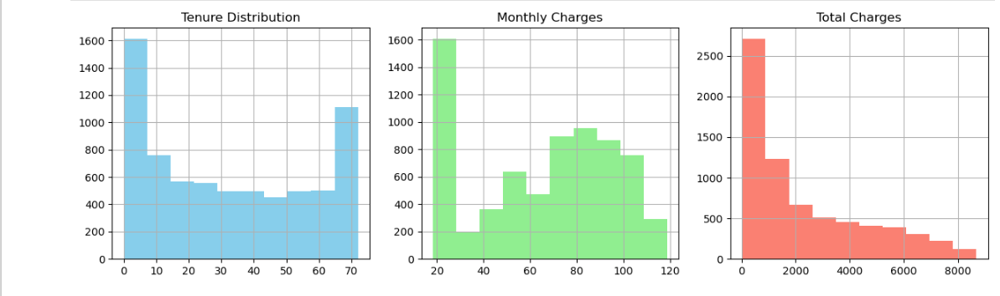

### Bar Charts:
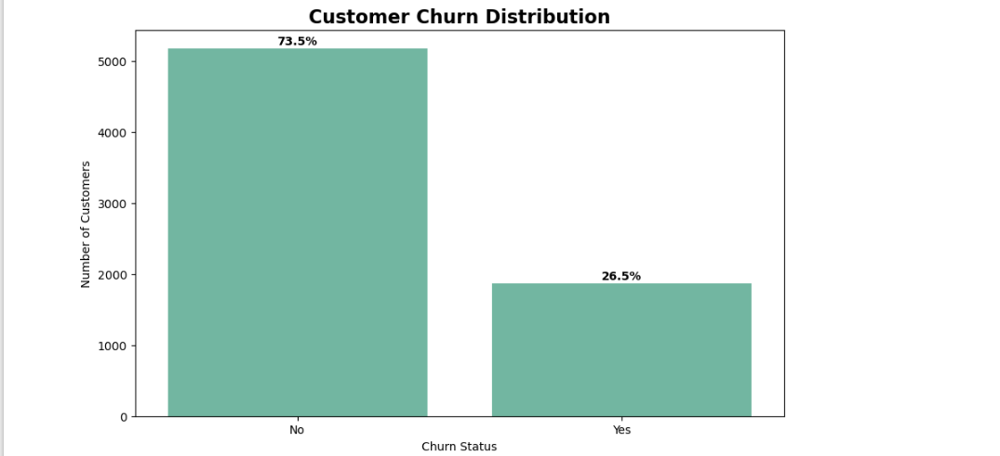
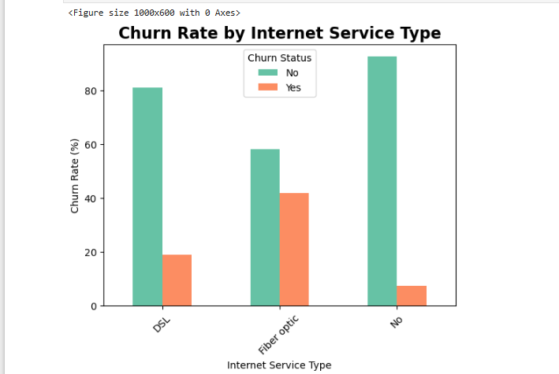
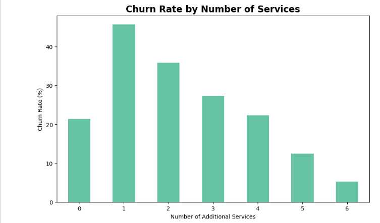

### Stacked Bar:
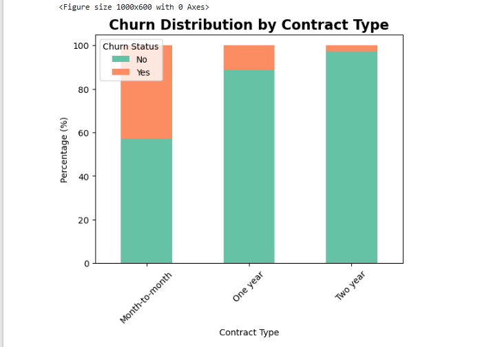
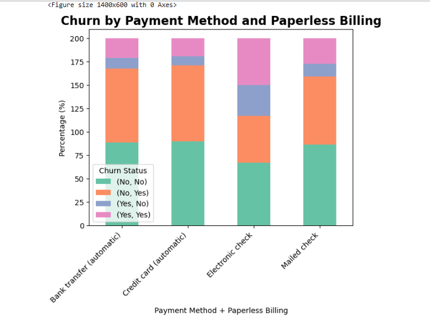

### Grouped Bar Chart:
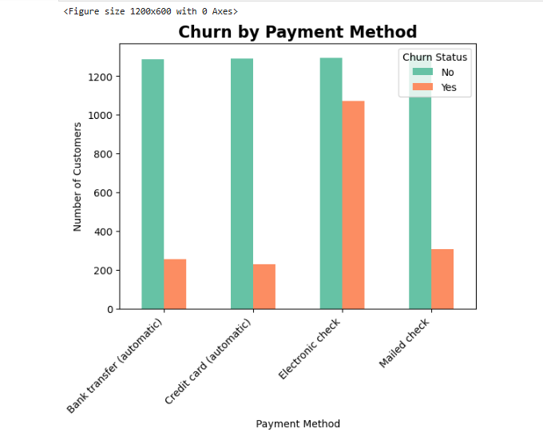

### Histogram + KDE:
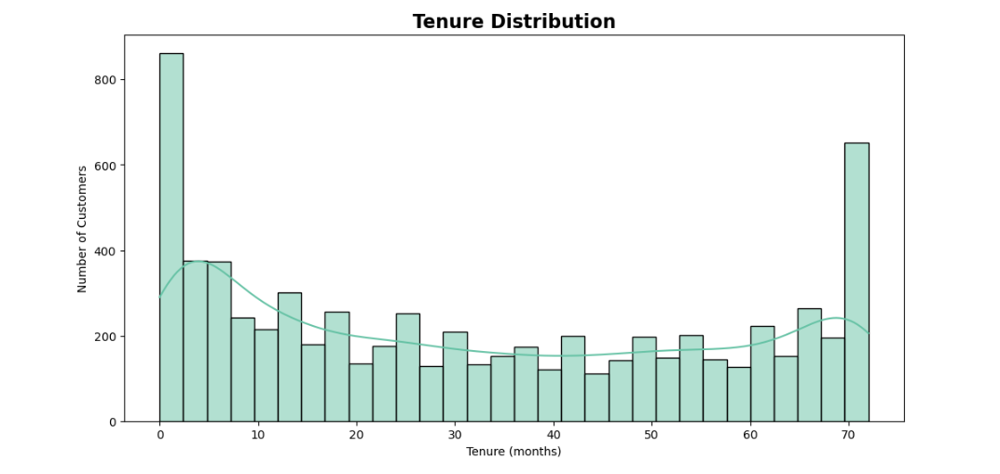

### Boxplot:
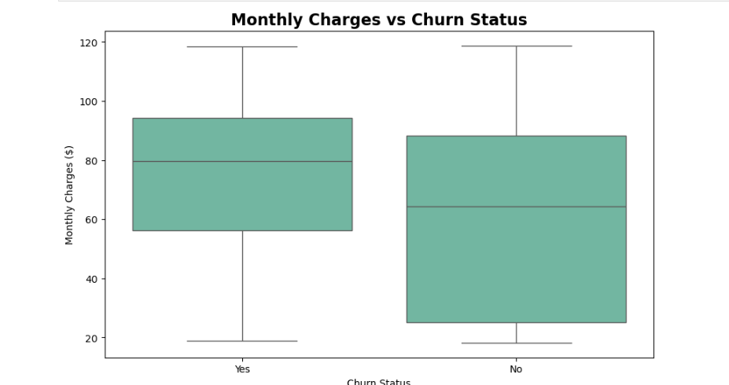

### Scatter plot:
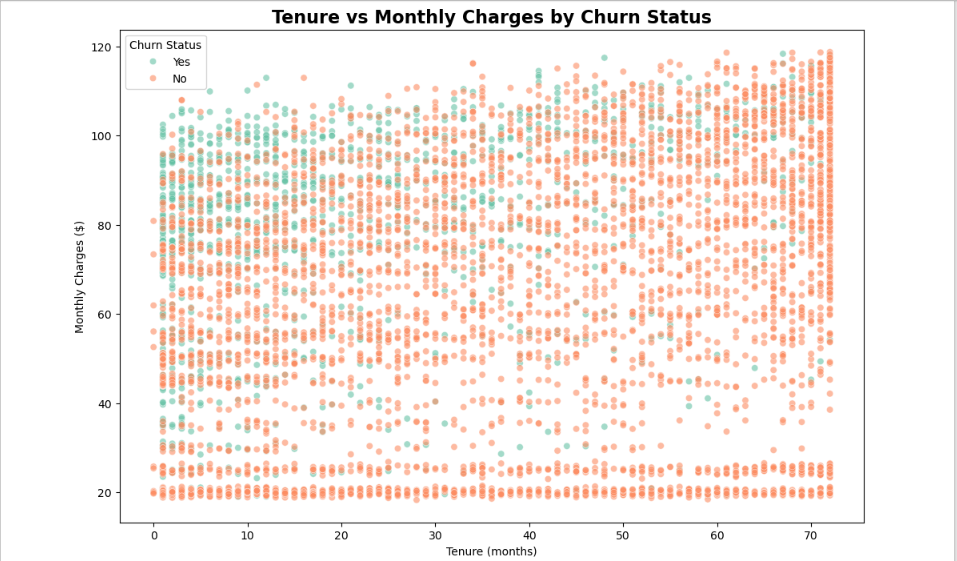

### Histogram
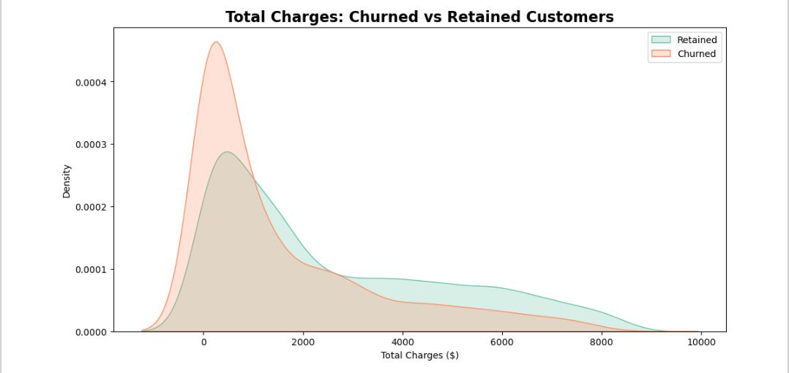

## License

This project is licensed under the MIT License – see the [LICENSE](LICENSE) file for details.


## Contributions

**Author**: Hafsa Noor Muhammad
* 🌐 [LinkedIn](https://www.linkedin.com/in/hafsa-noor-muhammad-67b96331a/)
* 📁 [GitHub](https://github.com/HafsaNoorMuhammad26)

---
